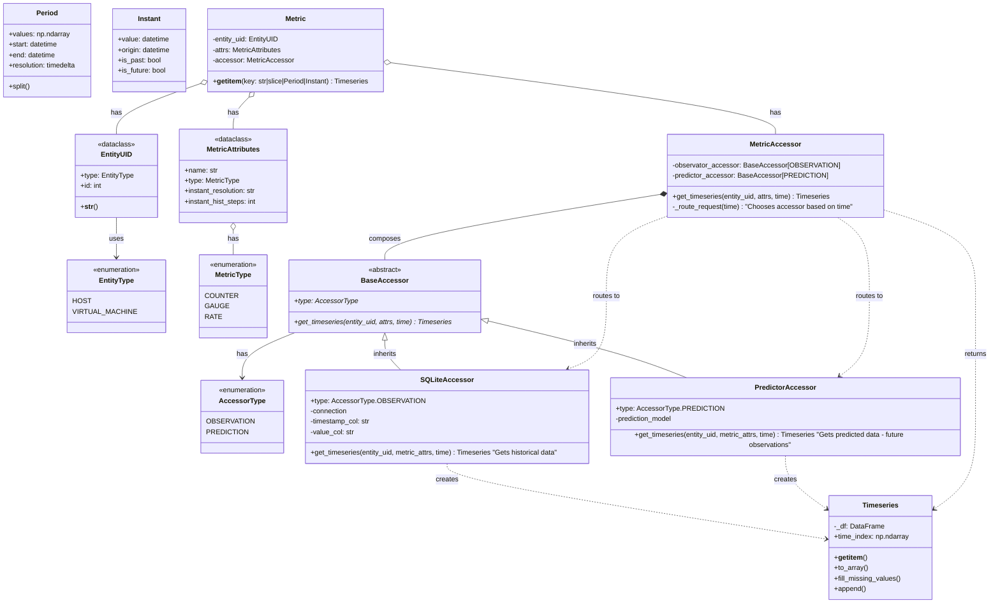

## Overview

Design a numpy-based Timeseries class that represents time-series data (univariate or multivariate) for OpenNebula entities (VMs, hosts), with support for time-based operations and filtering.

## Current Minimal SDK Structure and Relations to the Timeseries Class

